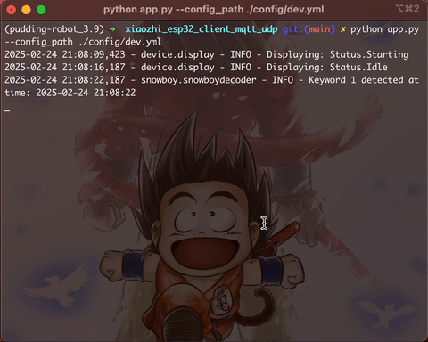

# 小智客户端python版

## 已测试环境🛠️
- python3.9
- mac x86_64/arm64
- 默认检测词（小来）
- brew install opus portaudio
- pip install -r requirements.txt -i https://mirrors.aliyun.com/pypi/simple
- export DYLD_LIBRARY_PATH="$(brew --prefix opus)/lib:$(brew --prefix portaudio)/lib:$DYLD_LIBRARY_PATH"
-  DEVICE_ID=xx:xx:xx:xx:xx:xx python app.py

## 使用方式📏
- [编译符合使用环境的snowboy二进制文件并替换](./snowboy/_snowboydetect.so) [参考snowboy](https://github.com/seasalt-ai/snowboy/blob/master/README_ZH_CN.md)
- [可选][替换检测词](./snowboy/resources/xiaolai.pmdl) [参考snowboy](https://github.com/seasalt-ai/snowboy/blob/master/README.md)
- [替换配置里的device_id](./config/default.yml) 可通过[虾哥](https://xiaozhi.me/)控制台.智能体.设备列表.Mac地址获取
- 安装依赖
- python app.py

## 演示🚀

## 鸣谢 🙏

- 感谢 [xiaozhi](https://github.com/78/xiaozhi-esp32) 提供免费 api。